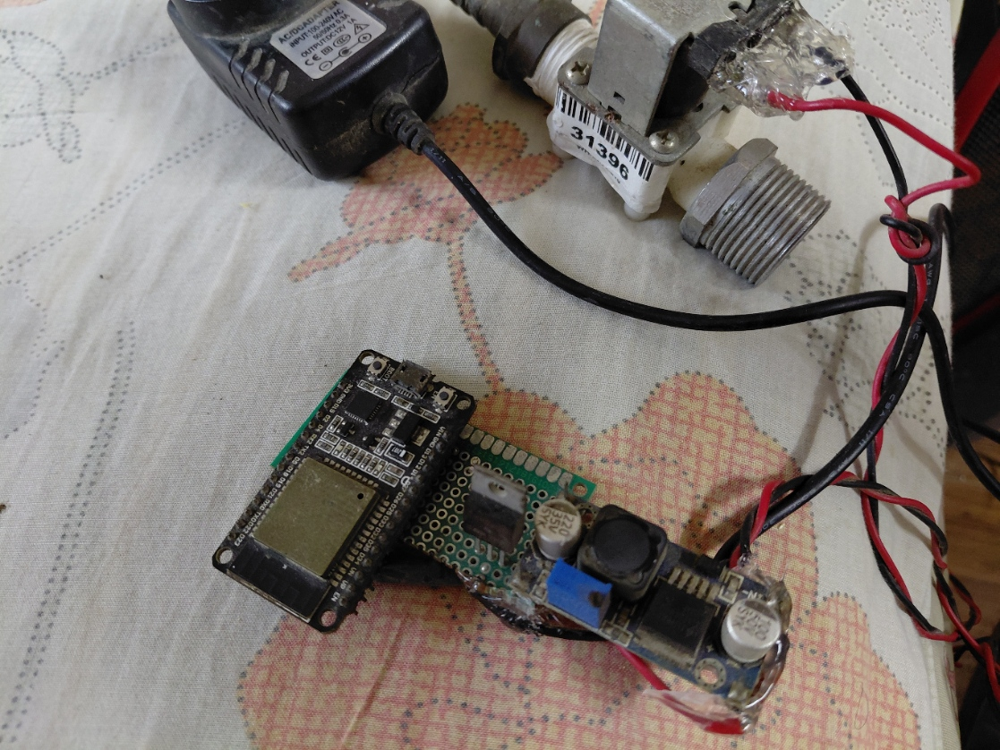

# Home Irrigator

An IoT-based irrigation controller for ESP32 (DoIT DevKit) with MQTT support, NTP time synchronization, and persistent scheduling.

## Features

- **WiFi Connectivity**: Auto-configures via WiFiManager with fallback AP mode
- **MQTT Control**: Remote control and scheduling via MQTT broker
- **NTP Time Sync**: Automatic epoch time synchronization at startup
- **Persistent Scheduling**: Schedule ON/OFF times stored in NVS (survives power loss)
- **LED Status Indication**: Multi-state blinking patterns for visual feedback
- **Scheduled Task Runner**: FreeRTOS-based blink task independent from main loop
- **Relay Control**: Direct GPIO control and scheduled automation
- **Missed Turn-ON Recovery**: Handles missed scheduled activations when device was offline

## Hardware Requirements

- **ESP32 DoIT DevKit v1**
- **Relay Module**: Connected to GPIO 5 (configurable)
- **LED**: Onboard LED on GPIO 2 (LED_BUILTIN)
- **MQTT Broker**: Public broker (default: `broker.emqx.io:1883`)

## Project Structure

```
home_irrigator/
├── src/
│   └── main.cpp          # Main application code
├── platformio.ini        # PlatformIO configuration
├── include/
└── lib/
```

## Configuration

### Hardware Pins

| Component | GPIO | Name |
|-----------|------|------|
| Relay | 5 | RELAY_PIN |
| Onboard LED | 2 | LED_BUILTIN |

### MQTT Broker Details

- **Host**: `broker.emqx.io`
- **Port**: `1883`

### Defaults

| Setting | Default | Description |
|---------|---------|-------------|
| WiFi SSID | AutoConnectAP | AP name when no saved credentials exist |
| WiFi Password | password | AP password (configurable) |
| NTP Servers | pool.ntp.org, time.nist.gov | Time sync servers |
| Timezone | UTC (0,0) | Configurable via `configTime()` |
| Relay Pin | GPIO 5 | Configurable via `#define RELAY_PIN` |

---

## MQTT Topics

### Subscribed Topics

#### `/home_irrigator/config` — Configure Scheduling
Sets interval-based or explicit ON times.

**Payload Format** (JSON-like):
```json
{
  "interval": 3600,
  "duration": 30,
  "TURN_ON_AT": 1708532400
}
```

**Parameters**:
- `interval`: Seconds between each ON cycle (required)
- `duration`: Seconds to keep relay ON during each cycle (required)
- `TURN_ON_AT`: Explicit epoch timestamp for first turn-ON (optional, overrides interval)

**Examples**:
```json
{"interval":3600,"duration":30}
```
Turn ON every hour (3600s) for 30 seconds.

```json
{"interval":3600,"duration":30,"TURN_ON_AT":1708532400}
```
Turn ON at specific epoch, then repeat every hour for 30 seconds.

#### `/home_irrigator/control` — Direct Control
Immediately turn relay ON or OFF.

**Payload Format**:
```json
{"output":"ON"}
```
or simply:
```
ON
```

**Valid Values**: `ON` or `OFF` (case-insensitive)

**Examples**:
```
ON
OFF
{"output":"ON"}
{"output":"OFF"}
```

### Published Topics

#### `/home_irrigator/ack` — Acknowledgement
Publishes the current relay state after control commands or scheduled actions.

**Values**: `ON` or `OFF`

**When Published**:
- After receiving `/home_irrigator/control` message
- When scheduled ON time is reached
- When scheduled OFF time (duration elapsed) is reached

#### `/home_irrigator/heartbeat` — Keep-Alive Signal
Published every 30 seconds to indicate device is online.

**Value**: `alive`

---

## LED Status Codes

The onboard LED indicates system state via blinking patterns:

| State | Pattern | Meaning |
|-------|---------|---------|
| **WIFI_CONNECTING** | 500ms ON, 500ms OFF | Attempting WiFi connection |
| **WIFI_CONNECTED** | 100ms ON, 100ms OFF | WiFi connected, syncing time |
| **MQTT_CONNECTING** | 150ms ON, 150ms OFF | Connecting to MQTT broker |
| **MQTT_CONNECTED** | 50ms blink every 2s | Ready and operating |
| **FAILED** | 1s ON, 1s OFF | WiFi connection failed |
| **MQTT_FAILED** | 2s ON, 2s OFF | MQTT connection failed |

---

## Setup & Installation

### 1. Prerequisites

- PlatformIO (VS Code extension or CLI)
- Arduino IDE or compatible environment
- ESP32 board support

### 2. Dependencies

The `platformio.ini` automatically installs:
- `WiFiManager` by tzapu
- `MQTT` (Arduino MQTT client)
- ESP32 core libraries

### 3. Build & Upload




Build the project:
```bash
platformio run --environment esp32doit-devkit-v1
```

Upload to the device:
```bash
platformio run --target upload --environment esp32doit-devkit-v1
```

Or use the VS Code tasks:
- **Compile Project**: Compiles firmware
- **Run Project** (picotool): Loads binary via USB
- **Flash**: Flashes via OpenOCD/CMSIS-DAP

### 4. First Time Setup

1. Power on the ESP32
2. LED will blink 500ms pattern (WiFi connecting)
3. Connect to AP `AutoConnectAP` (password: `password`)
4. Portal opens; select your WiFi and enter credentials
5. Device saves credentials and reboots
6. LED pattern changes to 150ms (MQTT connecting) → 50ms blink every 2s (MQTT ready)
7. Monitor serial console at `115200 baud` for debug output

---

## Usage Examples

### Example 1: Daily Irrigation at 6 AM

Send to `/home_irrigator/config`:
```json
{"interval":86400,"duration":60,"TURN_ON_AT":1708521600}
```

- Turns ON at epoch 1708521600 (specific date/time)
- Stays ON for 60 seconds
- Repeats every 86400 seconds (24 hours)

### Example 2: Every 2 Hours for 30 Seconds

Send to `/home_irrigator/config`:
```json
{"interval":7200,"duration":30}
```

- Turns ON 7200 seconds (2 hours) after receiving config
- Stays ON for 30 seconds
- Repeats every 2 hours

### Example 3: Manual Control

Send to `/home_irrigator/control`:
```
ON
```

Then later:
```
OFF
```

Device acknowledges on `/home_irrigator/ack` with `ON` or `OFF`.

---

## NVS Persistence

Schedule times are automatically saved to ESP32's NVS (Non-Volatile Storage) under namespace `"home_irrigator"`:

| Key | Description |
|-----|-------------|
| `next_on` | Next turn-ON time (epoch) |
| `off_time` | Scheduled turn-OFF time (epoch) |
| `is_on` | Current relay state (0 or 1) |

**Behavior**:
- On power loss, saved times are restored
- If device was offline when scheduled ON should occur, `next_on_time` is adjusted to `now + interval`
- Prevents the relay from retroactively turning on

---

## System Architecture

### Main Components

1. **WiFi Manager**: Auto-configures WiFi at startup
2. **MQTT Client**: Subscribes to `/home_irrigator/config` and `/home_irrigator/control`
3. **Scheduler**: Epoch-based ON/OFF logic in main loop
4. **Blink Task**: FreeRTOS task for non-blocking LED feedback
5. **NVS Module**: Persists schedule across power cycles

### Scheduling Logic

```
loop()
├── Check MQTT connection
├── Publish heartbeat (every 30s)
├── Adjust schedule for missed ON times
├── Turn relay ON when now >= next_on_time
├── Turn relay OFF when now >= off_time
└── Sleep 1 second
```

---

## Troubleshooting

### LED Not Blinking
- Check GPIO 2 is not in use elsewhere
- Verify `pinMode(LED_BUILTIN, OUTPUT)` was called
- Check power supply

### WiFi Not Connecting
- Verify SSID/password are correct
- Check distance to router
- Reset WiFi credentials: uncomment `wm.resetSettings()` in setup

### MQTT Not Connecting
- Verify broker is reachable: `ping broker.emqx.io`
- Check firewall rules on port 1883
- Monitor serial output for connection errors

### Relay Not Activating
- Check GPIO 5 is not in use
- Verify relay module is powered
- Test relay directly: send `{"output":"ON"}` to `/home_irrigator/control`

### Missed Scheduled Times
- Confirm NTP sync shows current epoch in serial logs
- Check if `interval` and `duration` are set via `/home_irrigator/config`
- Verify device time with MQTT broker timestamp

---

## Serial Console Output

Example startup sequence:

```
115200
[WiFi] Connecting to WiFi...
[WiFi] connected...yeey :)
Waiting for NTP time sync.....
Current epoch: 1708532400
Initialized scheduling, next ON at: 1708535200
Connecting to MQTT...
connected!
incoming: /home_irrigator/heartbeat - alive
Turned ON at epoch: 1708535200
Scheduled OFF at epoch: 1708535230
Turned OFF at epoch: 1708535230
```

---

## Future Enhancements

- [ ] Add multiple relay channels
- [ ] Support different timezone configurations
- [ ] Add sensor input (soil moisture, etc.)
- [ ] Cloud logging via HTTP
- [ ] Mobile app integration
- [ ] Backup broker support

---

## License

MIT License (example — update as needed)

## Support

For issues, submit details:
- Serial console output
- MQTT broker logs
- Last known configuration
- LED blink pattern at time of issue
